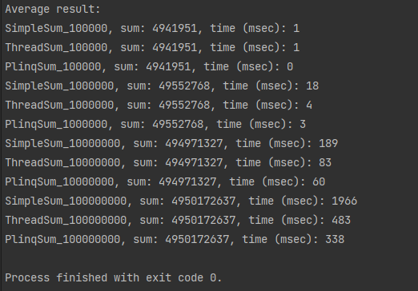

## Внутрипроцессное взаимодействие
###### Вебинар от 09.11.23

### Домашнее задание
Многопоточный проект

**Цель**:  
Применение разных способов распараллеливания задач и оценка оптимального способа реализации.

**Описание/Пошаговая инструкция выполнения домашнего задания**:
1. Напишите вычисление суммы элементов массива интов:  
Обычное  
Параллельное (для реализации использовать Thread, например List)  
Параллельное с помощью LINQ  
2. Замерьте время выполнения для 100 000, 1 000 000 и 10 000 000
3. Укажите в таблице результаты замеров, указав:  
Окружение (характеристики компьютера и ОС)  
Время выполнения последовательного вычисления  
Время выполнения параллельного вычисления  
Время выполнения LINQ  

### Инструкция запуска

1. Склонируйте приложение и зайдите в проект:  
   `git clone https://github.com/antoha-p/otus-hw8-09.11.23.git && cd otus-hw8-09.11.23`
2. Откройте решение и запустите проект:

